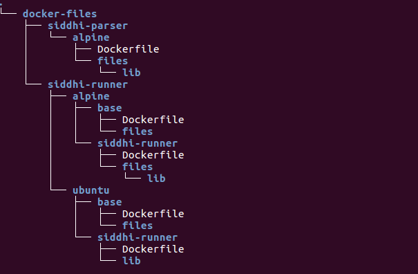

Docker Resources for Siddhi Cloud Native Streaming
====================================================

This repository contains the **Siddhi Runner**, **Siddhi Tooling** and **Siddhi Parser** resources for Alpine and Ubuntu.

These Docker resources would help you building generic Docker images for deploying the
corresponding distributions in containerized environments. Each Docker image includes the JDK, the relevant product distribution
and a collection of utility libraries. 

Configurations, custom JDBC drivers other than the default MySQL JDBC driver provided,
extensions and other deployable artifacts can be added to the image while building or via volume mounts to the containers spawned.

### Directory layout
 

These container images are published under **siddhiio** on the Docker hub, at:
1. [siddhiio/siddhi-runner-alpine](https://hub.docker.com/r/siddhiio/siddhi-runner-alpine)
2. [siddhiio/siddhi-runner-ubuntu](https://hub.docker.com/r/siddhiio/siddhi-runner-ubuntu)
3. [siddhiio/siddhi-tooling](https://hub.docker.com/r/siddhiio/siddhi-tooling)
4. [siddhiio/siddhi-parser](https://hub.docker.com/r/siddhiio/siddhi-parser)
